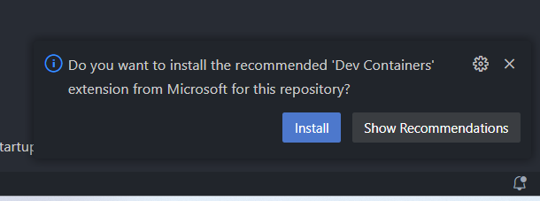
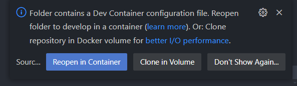

# Hylo Compiler Development Environment Setup Guide

If you want to try out Hylo, we recommend doing so in the online [Compiler Explorer](https://godbolt.org/z/dM3E4EdfE)
environment. Setting up a local development environment is a bit more involved, so we aim to provide guides for each
platform. If you have any questions or need help, feel free to ask on [Slack][join-slack].

The project also supports devcontainers, which make it easier to set up the environment in a virtualized container. Note
that this provides a bit slower overall performance and not all IDEs support it properly, but it's a good way to get
started.

# Table of Contents

- [Linux - Dev Container Setup](#linux---dev-container-setup)
- Linux - Local Setup (Todo)
- [Windows - Dev Container Setup](#windows---dev-container-setup)
- [Windows - Local Setup](#windows---local-setup)
- MacOS - Local Setup (Todo)

# Linux - Dev Container Setup
## Cloning the repository
- Clone the Hylo repository:
  ```shell
  git clone https://github.com/hylo-lang/hylo
  cd hylo
  git submodule update --init
  ```

## Setting up the Development Container
- Follow the tutorial from VSCode's website: https://code.visualstudio.com/docs/devcontainers/tutorial

## Building and Testing
See the [Building and Testing in Dev Containers](#building-and-testing-inside-dev-containers) section.

# Windows - Dev Container Setup
## Setting up Docker and WSL2

- **Install Docker Desktop.**
  ```shell
  winget install -e --id Docker.DockerDesktop
  ```
- **Install Windows Subsystem for Linux (WSL2).**<br>If you don’t already have WSL installed, run the following command to
  install ubuntu. (You are free to choose any distribution.)
    ```shell
    wsl --install
    ```
- **Reboot your computer.**<br>You will be prompted to create a WSL Linux user.
- **Enable WSL Integration in Docker.**
  Open Docker Desktop, and go to Settings (gear icon) → Resources → WSL Integration, and enable WSL integration for the distro you have installed if it’s not already enabled.
  

## Installing VSCode
```shell
winget install -e --id Microsoft.VisualStudioCode
```
- Restart your terminal.

## Opening the project in VSCode
- Clone the Hylo repository **inside WSL**:
  ```shell
  git clone https://github.com/hylo-lang/hylo
  cd hylo
  git submodule update --init
  ```
- Open the project in VSCode:
  ```shell
  code .
  ```

> Note: It’s important to clone the project inside WSL, as the builds might otherwise take substantially longer because of how the file systems are mapped between the subsystems.

> It is also recommended to add the folder to Windows Security’s exclusion list for real time scanning. This can be easily from IntelliJ/CLion that automatically add the project folders to the exclusion list, or also [manually](https://stackoverflow.com/a/58433724/9087223).

- Install the recommended Dev Containers extension:

- Reopen the project inside a Dev Container  by clicking the button in the popup or searching for the `Reopen in Container` action in the command palette (`F1`). 
- When the Dev Container has been successfully built, open a terminal inside VSCode and try to run the tests:
```swift
swift test --parallel
```
- Subsequently, you will be able to run, debug and test the project from the VSCode GUI, which uses SPM under the hood (not CMake).


## Making Git Credential Manager work inside WSL and Dev Containers
GitHub authentication will probably fail the first time you try pushing to your fork. As of now, some extra steps are needed to set up Git Credential Manager to work correctly inside WSL (and dev containers). We recommend to have a recent version of Git installed on Windows, then follow the guide from Microsoft: [Get started using Git on WSL | Microsoft Learn](https://learn.microsoft.com/en-us/windows/wsl/tutorials/wsl-git). 

> With a recent version of Git, the simplest way to authenticate is to use HTTPS authentication, and [generate a personal access token on GitHub](https://docs.github.com/en/authentication/keeping-your-account-and-data-secure/managing-your-personal-access-tokens#creating-a-fine-grained-personal-access-token). 

## Building and Testing
See the [Building and Testing in Dev Containers](#building-and-testing-inside-dev-containers) section.

# Windows - Local Setup
## Installing Git
```shell
winget install -e --id Git.Git
```
- Verify that git works after restarting terminal: `git --version`

## Installing Swift 5.10
```shell
winget install -e --id Swift.Toolchain
```
- Verify that swift works after restarting terminal: `swift --version` → *e.g. Swift version 5.10.1 (swift-5.10.1-RELEASE)*

## Installing Visual Studio 2022 Tools for Desktop C++ Development and Windows SDK
- Download VS 2022 (e.g. Community Edition) from [Visual Studio 2022 Community Edition](https://visualstudio.microsoft.com/vs/community/)
- Select Desktop C++ development and make sure to include these:
  - Clang tools for Windows (so that we get clang 17)
  - MSVC v143
  - Windows 11 SDK


- Add clang to the PATH environment variable

  - You can find clang.exe in: `C:\Program Files\Microsoft Visual Studio\2022\Community\VC\Tools\Llvm\x64\bin\`
    
  Verify that clang 17 is available through the command line by running `clang --version` . If the version is different, you might need to reorder entries in the PATH variable (entries in the front have higher priority).
    

- Add the MSVC tools to the PATH, so that Swift can use the link.exe tool:<br>
  `C:\Program Files\Microsoft Visual Studio\2022\Community\VC\Tools\MSVC\<VERSION>\bin\Hostx64\x64`

## Installing CMake and Ninja
```shell
winget install -e --id Kitware.CMake
winget install -e --id Ninja-build.Ninja
```
- Verify that cmake works after restarting the terminal: `cmake --version` (should be ≥ 3.29)
- Verify that ninja works by `ninja --version`

## Installing LLVM 17

To install the correct LLVM build, download the latest release for your architecture from https://github.com/hylo-lang/llvm-build/releases. Extract the folder into a suitable location, e.g. at `C:\Program Files\LLVM-17`, then add the build folder to the PATH environment variable. Make sure to place this path before any of the Swift-related PATH includes, since Swift already contains an LLVM and entries on the top get higher priority. 


IMPORTANT:

Replace the path `C:/Program Files/Microsoft Visual Studio/2022/Enterprise/` with your Visual Studio’s installation directory inside `lib/cmake/llvm/LLVMExports.cmake`. *(For the exact reason why this is needed, see the discussion on the [LLVM Discussion Forum](https://discourse.llvm.org/t/llvm-assumes-specific-visual-studio-installation-after-build/79857/3)) or the issue [#15](https://github.com/hylo-lang/llvm-build/issues/15).*

## Making Symbolic Links Work
- Enable Developer Mode:
  
- Enable symbolic links in git globally: `git config --global core.symlinks true` (it is also possible to do so locally).

## Cloning the Repository
```shell
git clone https://github.com/hylo-lang/hylo.git
cd hylo
git submodule update --init
```

## Generating llvm.pc
Run the following command in Powershell:
```shell
& 'C:\Program Files\Git\bin\bash.exe' .\Tools\make-pkgconfig.sh .\llvm.pc
```
Then set the environment variable `PKG_CONFIG_PATH` to the directory of `.llvm.pc`.

## Building the Project
Building with SPM doesn't work properly on Windows for this project, so we have to use CMake which is now more reliable.

- Configure the CMake project:
  ```shell
  cmake -D CMAKE_BUILD_TYPE=release -D LLVM_DIR="C:\Program Files\LLVM-17\lib\cmake\llvm" -G Ninja -S . -B .ninja-build
  ```

- Build the project:
  ```shell
  cmake --build .ninja-build
  ```

- Run the tests:
  ```shell
  ctest --parallel --test-dir .ninja-build
  ```

> Note: Swift Package Manager is poorly supported on Windows and we've been seeing a number of tests act flaky on Windows only when run under Swift Package Manager. After running the previous steps, the SPM builds didn't succeed for me, and the VSCode Swift extension's build and test integration cannot work until then. 

> If you are using VSCode and you managed to build using the CMake Tools extension, please update this document with the steps to set it up.

# Building and Testing inside Dev Containers
Once you open your project in a dev container, you will be able to build and test using SPM, and CMake. The VSCode Swift plugin uses SPM under the hood, and the testing targets should appear in the VSCode testing tab where you can select individual test cases or test suites to run or debug.

You can also use the following commands to build or test the project:
- Using SPM:
  ```shell
  # Builds all targets in release mode and outputs the hc binary to .build/release.
  swift build -c release

  # Runs all tests in parallel
  swift test -c release --parallel
  ```
- Using CMake:
  - Configuring the project:
    ```shell
    cmake -D CMAKE_BUILD_TYPE=debug -D LLVM_DIR=/opt/llvm-17.0.6-x86_64-unknown-linux-gnu-MinSizeRel/lib/cmake/llvm  -G Ninja -S . -B .ninja-build
    ```
  - Building
    ```shell
    cmake --build .ninja-build
    ```
  - Testing
    ```shell
    ctest --parallel --test-dir .ninja-build
    ```

[join-slack]: https://join.slack.com/t/val-qs97696/shared_invite/zt-1z3dsblrq-y4qXfEE6wr6uMEJSN9uFyg
